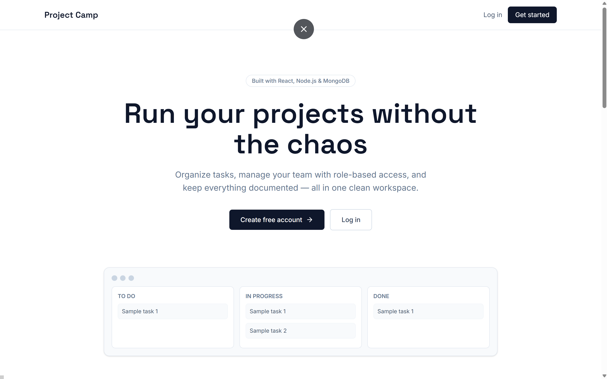

# Project Camp — Frontend

A full-stack project management application — organize projects, manage tasks with subtasks, assign team roles, and keep shared notes, all in one clean workspace.

**Live demo:** _add your Vercel URL here_
**Backend repo:** _add your backend GitHub URL here_


---

## ✨ Features

### Authentication
- Register / Login with JWT (access + refresh tokens)
- Email verification on sign-up
- Forgot / reset password flow
- Persistent sessions with automatic token refresh

### Projects
- Create, view, and manage multiple projects
- Search and sort projects on the dashboard
- Role-based access per project — **Admin**, **Project Admin**, **Member**

### Tasks & Subtasks
- Kanban-style board — To Do / In Progress / Done
- Assign tasks to team members
- Inline editable task titles
- Change task status directly from the task view
- Subtasks with progress tracking and completion toggles

### Team & Collaboration
- Invite members by email with a specific role
- Update or remove team members (Admin only)
- Shared project notes with edit/delete (Admin only)

### UX details
- Toast notifications for every action (success/error)
- Confirmation dialogs before destructive actions (delete/remove)
- Loading skeletons and spinners
- Friendly, specific error messages (not just "failed")
- Responsive design across devices

---

## 🛠 Tech Stack

**Frontend**
- React (Vite)
- React Router
- Tailwind CSS
- Axios
- Lucide React (icons)

**Backend** (see [backend repo](#))
- Node.js / Express
- MongoDB + Mongoose
- JWT authentication
- Nodemailer (email verification & password reset)

**Deployment**
- Frontend: Vercel
- Backend: Render
- Database: MongoDB Atlas

---

## 📂 Project Structure

```
src/
├── api/            # Axios instances & API call functions
├── components/
│   ├── auth/       # Auth visual panel
│   ├── common/     # Spinner, ConfirmDialog
│   ├── layout/     # Navbar, ProfileMenu
│   └── project/    # MembersPanel, NotesPanel
├── context/        # AuthContext, ToastContext
├── pages/          # Landing, Login, Register, Dashboard, ProjectDetails, TaskDetails, Profile
├── App.jsx
└── main.jsx
```

---

## 🚀 Getting Started

### Prerequisites
- Node.js (v18+)
- A running instance of the [backend](#) (local or deployed)

### Installation

```bash
git clone https://github.com/omk-collab/projectmanagement-frontend.git
cd projectmanagement-frontend
npm install
```

### Environment Variables

Create a `.env` file in the root:

```
VITE_API_BASE_URL=http://localhost:9000/api/v1
```

(Replace with your deployed backend URL in production.)

### Run locally

```bash
npm run dev
```

App runs at `http://localhost:5173`

---

## 📸 Screenshots

_Add screenshots of your Landing page, Dashboard, and Task board here — this section makes the biggest difference for anyone browsing the repo without running it locally._

```



```

---

## 🔗 Connect

- **GitHub:** [github.com/omk-collab](https://github.com/omk-collab)
- **LinkedIn:** [linkedin.com/in/om-khairnar-scoe](https://www.linkedin.com/in/om-khairnar-scoe/)
- **Email:** omkhairnar49@gmail.com

---

## 📄 License

This project is for learning and educational purposes.
